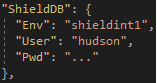
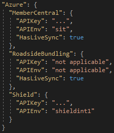
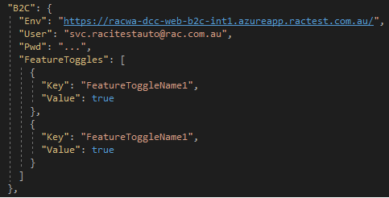
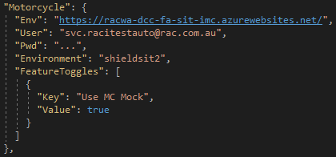
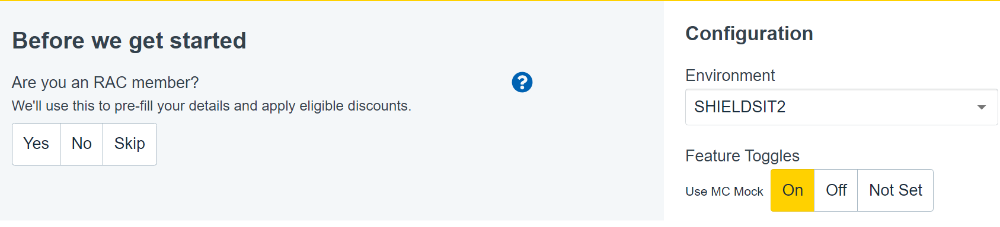

# Selenium config file
> To view this in Visual Studio, go to dropdown menu "Extensions-> Manage Extensions" and search for markdown. There are a large number of options, I've used `Markdown Editor`, but you can use any you like.

## What is it?
There is a `config.json` which serves the purpose of defining how the Selenium tests find the applications under test, and work with the various interfaces/databases that are needed.

This file is in a JSON format, which was chosen as a simple, machine readable format for being configurable by build pipelines, and for passing values into the tests.

## Why?
We don't want a large array of sensitive credentials to be hardcoded in to the tests, or being committed into the Git repository. We wanted a mechanism that allowed build pipelines to easily change at execution time, and that pipeline can then leverage secure storage (such as KeyVault) to retrieve desired sets of configuration.

## So how do I use it when running these locally?
Good question, hopefully the below will assist.

### Browser configurations:

#### B2C
The `B2C.Env` parameter takes just an URL. This is the URL for the existing legacy B2C which should take the automation to the B2C test landing page.

#### Motorcycle
The `Motorcycle.Env` parameter is the URL for Spark Motorcycle online which was built using the React framework.

#### Caravan
The `Caravan.Env` parameter is the URL for Spark Caravan online which is being built at the moment using the React framework.

There is a `User` and `Pwd` parameter that goes with this, and these are the credentials to get past the Windows AD prompts. The test team has been provided with a AD service account which has MFA (multi-factor authentication) disabled, to make it possible for the automation to access these Spark pages.
The username and password can be found in the **Test Team KeePass**.

#### ShieldWeb
The `ShieldWeb.Env` is driven by environment designators, *not URLs*. It expects values like:
- ptsit1/reuat1/shieldint1/shieldsit2/shielduat1

NOTE: the above list is not exhaustive, just indicative.

There is a `User` and `Pwd` parameter that goes with this, and that is because the Shield UI requires a user to log in. For the "User" only the username prefix needs to be provided, as the code will find the first free login that can be used (in case other tests are running in parallel and consuming users). We typically created automation users or the format "AutoMationNN", so this value just remains "AutoMation". Have a chat with some of the test team if you aren't sure what password to use.

### Database configurations:
The Shield database is the only database that automation actively connects to. This is used for the majority of test cases.

`ShieldDB.Env` is driven by environment designators, similar to ShieldWeb. The same designators should be used here.

The `User` and `Pwd` should be populated with the appropriate test user credential, which is a read-only local account for the database. These credentials can also be found in the **Test Team KeePass**.

### APIM configurations:
Each APIM interface supports two main parameters:
* `APIKey`, which is the secure key for a particular APIM domain (dev/sit/uat). These keys can be found from the Azure Portal, which requires your PA account to log in to find. These are _not_ kept in the **Test Team KeePass**.
* `APIEnv`, which is an additional parameter to assist in routing the messages to the correct environment.

#### APIEnv values for Member Central
This value should just be either "dev" / "sit" / "uat". We only have the one Member Central in each zone.

#### APIEnv values for STS (Secure Token Service)
This value should just be either "dev" / "sit" / "uat". We only have the one STS in each zone.

#### APIEnv values for Shield
This value should identify the specific Shield instance that is to receive the API request. This follows the same designators that are used for Shield databases and Shield Web;
  - ptsit1/reuat1/shieldint1/shieldsit2/shielduat1, etc

#### APIEnv values for SendGrid
TestAutomation has support for using SendGrid to generate outbound emails (which differs from "Email support" below which is using Mailosaur to receive inbound (to test automation) emails.

SendGrid requires both the API key, as well as the `APIEnv` value which should indicate whether it is targeting SIT or UAT integrations.

### Email support
Support for having emails go to Mailosaur and for automation to retrieve them has been introduced. The connection to the Mailosaur server requires three values, which are really derived from 2 parameters:
* APIKey, which is the API key for the service account which connects to Mailosaur
* Server ID, which is essentially a folder which the relevant emails are going to.

The Server ID is a parameter that provides us two of our `config.json` values:
* `ServerID` which is the value of the Server ID.
* `Domain` which will be the email domain portion of all test emails. This is always of the format of `<serverID>.mailosaur.net`.  So a test email would be `john.smith@<server ID>.mailosaur.net`.

### Feature Toggles
Modifies feature toggles in B2C and Spark platform applications. Does not support feature toggles in Shield.
If a toggle is already in the desired state, then the test automation will not change it. e.g.: if "featureX" is requested true, and the automation finds that it is already enabled, then it does not amend it.

#### B2C
This allows for overriding B2C feature toggles for the automation.

It is simply a definition of the feature toggle name (exactly as it is displayed in B2C), and a boolean value for whether that toggle should be enabled (true) or disabled (false).

#### Spark Applications
This allows for overriding the configuration of Spark applications (MCO currently supported)' environment and feature toggles.

Same concept as B2C with additional 'Environment' configuration which represents the Shield environment wherein user can override in which the Spark application will be pointed to.
Currently set as empty string "", which means pointing to the default Shield environment the Spark application is hooked into. The Environment is case insensitive.

Define the feature toggle name exactly (spacing and casing) as it is displayed in Configuration -> Feature Toggles, and a boolean value for whether that toggle should be enabled (true) or disabled (false).

##### MCO Feature Toggle

##### Result
